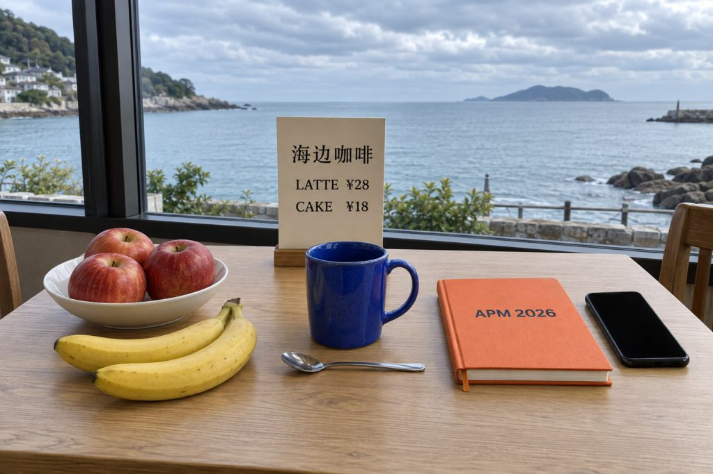
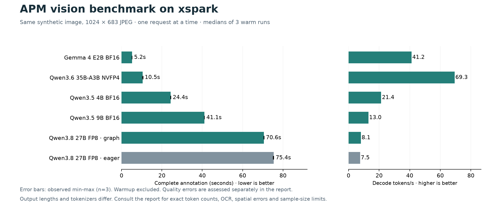

APM 现在通过 API 调用我这台 DGX Spark，给照片生成标注。用的是 Qwen3.8-27B FP8，能识别物体、读文字，也能返回应用需要的结构化结果。问题是慢：一张照片要等一分钟以上，批量处理相册就更难等了。

2026 年 9 月 23 日，我让 Codex 测了五款多模态模型、六种运行配置。输入固定为一张合成图和 APM 的标注提示词，共发出 30 次请求，其中 18 次用于预热后的速度统计。图像和输出也由 Codex 复核，尚未做独立人工盲评。

这轮测完，我更想继续试 Qwen3.6-35B-A3B NVFP4。完整标注从 75.39 秒降到 10.52 秒，耗时约为原来的七分之一，但它写错了香蕉的位置和手机朝向。Gemma 4 E2B 更快，只用 5.23 秒，可惜漏掉了好几个物体。

## 测试用的这张图

测试用的是 imagegen 生成的咖啡馆图片，没有读取私人相册。原图按 APM 主请求的尺寸策略缩放到 1024×683，编码为质量 82 的 JPEG。所有模型收到同一个文件，再由各自的视觉预处理模块处理。



评分答案以实际生成的图片为准：白碗里有三个红苹果，两根黄色香蕉放在桌上；蓝杯把手朝右，银色勺子在杯子前方，也就是画面下方；橙色封面写着 `APM 2026`，右侧黑色手机屏幕朝上、没有亮起。菜单上是 `海边咖啡 / LATTE ¥28 / CAKE ¥18`，窗外是白天的海景和多云天空。图中没有可确认的人物或动物。

这张图可以检查计数、颜色、空间关系和中英文 OCR，也方便观察模型会不会凭空标出人物。

[查看生成原图](/media/xspark-vlm-2026-09-23/cafe-original.png)

## 测量方法

完整标注沿用 Android 中的 `photo-annotation-zh-v7` 提示词，JSON Schema 的字段和限制也与应用一致。模型需要返回照片描述、标签、可见文字，以及物体、人物、场景等结构化信息。除此之外，再用 23 项固定视觉问答检查具体事实。

- 每个配置先做一次完整标注预热，再连续测三次标注，最后做一次视觉问答。速度取三次正式标注的中位数，同时保留最小值和最大值。
- 单并发，16K 上下文，2 GiB KV 缓存；`temperature=0`、`seed=23`、关闭思考。完整标注最多输出 1536 token，问答最多 640 token。
- 每次请求使用新的缓存盐和图片 UUID。临时模型关闭多模态处理缓存，观测到的前缀缓存命中为零，避免反复测试同一张图时高估速度。
- 请求从 Spark 本机直接发给模型 API。测试采用流式返回，以便记录首字时间；完整耗时一直计到 JSON 返回完毕。APM 要等完整 JSON 才能使用结果，所以更关心后一项。

计时不含手机图片处理、无线网络和 New API 转发，也没有测多并发吞吐。原有 27B 和 IndexTTS 服务仍驻留内存，临时模型逐个运行，期间没有向 IndexTTS 发任务。因此，这组数据对应的是这台机器保留既有服务时的状态。

## 完整标注用了多久



只有当前生产使用的 27B 是 eager 模式，其余配置都启用了单并发解码 CUDA Graph。以下首字时间和解码速度同样是三次测量的中位数。

- Qwen3.8-27B FP8，eager：完整标注 **75.39 秒**，范围 75.18–75.40 秒；首字 0.877 秒，解码 7.53 token/s，输出 561 token。
- Qwen3.8-27B FP8，Graph：完整标注 **70.56 秒**，范围 70.53–70.61 秒；首字 0.873 秒，解码 8.05 token/s，输出 561 token。
- Qwen3.5-4B BF16，Graph：完整标注 **24.38 秒**，范围 24.32–24.41 秒；首字 0.264 秒，解码 21.36 token/s，输出 515 token。
- Qwen3.5-9B BF16，Graph：完整标注 **41.06 秒**，范围 41.05–41.09 秒；首字 0.459 秒，解码 12.98 token/s，输出 527 token。
- Qwen3.6-35B-A3B NVFP4，Graph：完整标注 **10.52 秒**，范围 10.36–10.70 秒；首字 0.294 秒，解码 69.35 token/s，三次输出 698–721 token。
- Gemma 4 E2B BF16，Graph：完整标注 **5.23 秒**，范围 5.22–5.23 秒；首字 0.153 秒，解码 41.19 token/s，输出 209 token。

[打开可缩放图表](/media/xspark-vlm-2026-09-23/comparison.svg)

27B 不到一秒就开始返回内容，接下来却还要生成很久。启用 Graph 后，三次正文都与 eager 逐字相同，完整耗时缩短约 6.4%，仍要七十多秒。

27B 的耗时是 35B-A3B 的约 7.17 倍，后者输出的 token 还更多。这个 MoE 模型总参数约 35B，每 token 激活约 3B。本次采用 NVIDIA 的 NVFP4 权重，配合官方 Spark 配方中的 Marlin MoE 和 FlashInfer attention。权重使用 NVFP4/FP8 混合量化，Marlin 走权重量化路径；这个结果不能称为原生 FP4 计算性能。[NVIDIA 模型说明](https://huggingface.co/nvidia/Qwen3.6-35B-A3B-NVFP4)、[vLLM 的 GB10 配方](https://recipes.vllm.ai/Qwen/Qwen3.6-35B-A3B?hardware=dgx_spark_gb10)

Gemma 返回的内容很短，完整 JSON 约 525 字符，其他模型约 1358–1893 字符。这些字符数包含缩进和空白，各模型的 tokenizer 也不同，不能直接当作信息量来比较。对 APM 来说，还得看实际等了多久、结果里漏了什么。

本轮没有开启 `torch.compile`、MTP 或其他投机解码，还没测到各模型的速度上限。

## 各模型实际返回了什么

下表统一取预热后的第一次正式标注。照片描述、标签和识别文字保留原文；结构化字段只改成便于阅读的写法，所有字段值都列出，空列表也保留。Qwen3.8-27B 的 eager 与 Graph 三次正文逐字一致，因此合并为一行，其余模型使用 Graph 配置。评价列依据同一张图的三次标注复核；“独立问答”分数来自另一次定向问答，不等同于表中完整标注的正确率。

| 模型 / 配置 | 照片描述（原文） | 标签（原文） | 识别文字（原文） | 物体、数量与属性 | 人物及其余字段 | 输出评价（仅限本图） |
| --- | --- | --- | --- | --- | --- | --- |
| Qwen3.8-27B FP8（eager / Graph） | 木质桌面上摆放着装有红苹果的白色碗、两根香蕉、蓝色马克杯、金属勺、橙色笔记本、黑色手机以及写有“海边咖啡”的立牌，背景是透过窗户可见的海景与多云天空。 | 苹果、香蕉、马克杯、勺子、笔记本、手机、立牌、海景、窗户、木桌 | 海边咖啡 LATTE ¥28 CAKE ¥18 APM 2026 | 苹果 × 3（红色）；碗 × 1（白色）；香蕉 × 2（黄色）；马克杯 × 1（蓝色）；勺子 × 1（金属）；笔记本 × 1（橙色）；手机 × 1（黑色）；立牌 × 1（米色）；桌子 × 1（木质） | 人物：空列表；动作：空列表；昼夜：天亮；天空：云；场景：室内、海边；天气：多云 | 核心计数 8/8、OCR 4/4，无人物误报；三次标注均未发现本图中的明显内容错误。独立问答 23/23（统一评分规则复核后）。本轮可用作质量参照。 |
| Qwen3.6-35B-A3B NVFP4 | 一张木质桌面上摆放着装有苹果和香蕉的碗、蓝色马克杯、橙色笔记本、手机及价格牌，背景是透过窗户看到的海岸风景。 | 桌子、水果、苹果、香蕉、马克杯、笔记本、手机、价格牌、咖啡、蛋糕、海景、窗户、室内、食物、餐具、勺子 | 海边咖啡 LATTE ¥28 CAKE ¥18 APM 2026 | 苹果 × 3（红色、在碗中）；香蕉 × 2（黄色）；碗 × 1（白色、陶瓷）；马克杯 × 1（蓝色、陶瓷）；勺子 × 1（金属）；笔记本 × 1（橙色、硬皮）；手机 × 1（黑色、屏幕关闭）；价格牌 × 1（立牌、白色卡片）；桌子 × 1（木质）；椅子 × 2（木质）；窗户 × 1（大玻璃窗） | 人物：空列表；动作：空列表；昼夜：天亮；天空：多云、阴天；场景：室内、咖啡馆、餐厅；天气：多云、阴天 | 核心计数 8/8、OCR 4/4，无人物误报；本次描述把桌上的香蕉误放进碗里。第 2、3 次还写错手机朝向，第 3 次加入早餐、下午茶等推测标签。独立问答 23/23，仍需复核空间关系和额外属性。 |
| Qwen3.5-4B BF16 | 一张木质桌子上摆放着水果、蓝色马克杯、橙色笔记本和手机，背景是透过窗户看到的海景。 | 桌子、水果、杯子、笔记本、手机、海景、咖啡、苹果、香蕉、窗户 | 海边咖啡 LATTE ¥28 CAKE ¥18 APM 2026 | 苹果 × 3（红色）；香蕉 × 2（黄色）；马克杯 × 1（蓝色）；笔记本 × 1（橙色）；手机 × 1（黑色）；勺子 × 1（金属）；碗 × 1（白色）；椅子 × 2（木质） | 人物：不确定 × 1；动作：空列表；昼夜：天亮；天空：多云；场景：室内；天气：多云 | 核心计数 7/8、OCR 4/4；菜单卡未单独计数，三次均误报 1 人。独立问答 22/23，勺子方向答错。文字识别较完整，但人物误报会影响相册检索。 |
| Qwen3.5-9B BF16 | 一张木质桌面上摆放着水果、蓝色马克杯、橙色笔记本、手机和写有“海边咖啡”的立牌，窗外是海景和多云天空。 | 海边、咖啡、水果、苹果、香蕉、马克杯、笔记本、手机、海景、多云、桌子、餐具 | 海边咖啡 LATTE ¥28 CAKE ¥18 APM 2026 | 苹果 × 3（红色、在白色碗中）；香蕉 × 2（黄色）；马克杯 × 1（蓝色）；勺子 × 1（金属）；笔记本 × 1（橙色、封面有文字）；手机 × 1（黑色）；立牌 × 1（米色、有文字） | 人物：不确定 × 1；动作：空列表；昼夜：不确定；天空：云；场景：室内、海边；天气：多云 | 核心计数 7/8、OCR 4/4；白碗只出现在苹果属性中，未单独计数；三次均误报 1 人，白天判断为“不确定”。独立问答 22/23，勺子方向答错。本图未见比 4B 明显更好的标注效果。 |
| Gemma 4 E2B BF16 | 一张桌子上摆放着食物、杯子和书籍的场景。 | 食物、杯子、书籍、桌面 | 海边咖啡 LATTÉ ¥28 CAKE ¥18 | 杯子 × 1（蓝色）；书籍 × 1（橙色）；香蕉 × 2（黄色）；勺子 × 1（金属）；手机 × 1（黑色） | 人物：不确定 × 1；动作：空列表；昼夜：室内；天空：不确定；场景：桌面场景；天气：不确定 | 核心计数 5/8、OCR 2/4；漏标苹果、碗和菜单卡，把 LATTE 写成 LATTÉ，漏掉 APM 2026，三次均误报 1 人。独立问答 20/23。遗漏和误识别较多，暂不适合当前 APM 标注。 |

这张表记录模型当时的回答，错误内容也原样保留。35B MoE 第一次返回手机“屏幕关闭”，第二、第三次才出现“屏幕朝下”；评价列覆盖三次标注。网页上的宽表可以横向滚动。

## 内存和启动成本

机器为 NVIDIA GB10、128 GB 统一内存，操作系统可见约 121 GiB；Ubuntu 24.04 ARM64，驱动 580.173.02。运行时使用 vLLM 0.28.0、PyTorch 2.13.0、Transformers 5.16.1 和 FlashInfer 0.6.16.post3。

内存取自 `nvidia-smi` 的模型进程统计，包含 KV 缓存和运行开销。GB10 共享物理内存，下面记的是进程用量，不是独立显存容量。

- 27B FP8 eager：31.34 GiB；服务原本已常驻，没有重新计启动时间；首次标注 74.97 秒。
- 27B FP8 Graph：30.97 GiB；启动至健康检查通过 255.30 秒；首次标注 72.24 秒。
- 4B BF16 Graph：11.00 GiB；启动 155.20 秒；首次标注 26.42 秒。
- 9B BF16 Graph：20.06 GiB；启动 105.18 秒；首次标注 42.80 秒。
- 35B MoE NVFP4 Graph：23.56 GiB；启动 480.61 秒；首次标注 45.00 秒。
- Gemma 4 E2B Graph：11.68 GiB；启动 125.19 秒；首次标注 7.34 秒。

启动时间各记了一次，文件缓存、加载顺序和内核编译缓存都会影响结果，不能据此比较冷启动性能。MoE 首次编译耗时较长，第一次请求也等了约 35.7 秒才开始返回内容，预热后首字降到 0.294 秒。如果让服务常驻，这笔启动成本不必每张照片都付一次。

五款模型共 76 个权重文件都逐一校验了 SHA-256，与对应官方版本匹配。Gemma 是这次新增下载，其余复用已有文件。本次使用的固定版本如下，所列权重文件均通过校验：

- Qwen/Qwen3.5-4B：`851bf6e806efd8d0a36b00ddf55e13ccb7b8cd0a`，2 个权重文件。
- Qwen/Qwen3.5-9B：`c202236235762e1c871ad0ccb60c8ee5ba337b9a`，4 个权重文件。
- nvidia/Qwen3.6-35B-A3B-NVFP4：`1355db6a052410cfd62085d94b58866fd0f2c3c5`，3 个权重文件。
- Qwen/Qwen3.8-27B-FP8：`017b9c7af6b5689d5dd426a76e0bc077eb5ca20a`，66 个权重文件。
- google/gemma-4-E2B-it：`3e22461f65e89153144f8adb70e3b8c2cc9845a7`，1 个权重文件。

## 测试图的生成提示词

下面是实际使用的完整提示词。评分依据最终图片，不把提示词中的要求直接当成生成结果。

```text
Create one photorealistic natural photograph for a controlled vision-language model benchmark. Landscape 3:2 composition, sharp focus across the whole table, natural overcast daytime light, no stylization. Scene: an unoccupied small seaside cafe table next to a large window. Outside the window there is an unmistakable calm sea and cloudy daytime sky. On the light wooden tabletop, place exactly three red apples in one shallow white bowl on the left; exactly two yellow bananas on the tabletop directly in front of that bowl; one cobalt-blue ceramic mug in the middle, with its handle pointing to the right; one closed orange notebook on the right, whose large clear cover text is exactly 'APM 2026'; one black smartphone with a completely dark blank screen lying to the right of the notebook; and one silver teaspoon lying horizontally immediately in front of the blue mug. At the rear of the table, a single upright cream-colored menu card faces the camera squarely. Its text must be large, crisp, and exactly these three lines: '海边咖啡' then 'LATTE ¥28' then 'CAKE ¥18'. No other text anywhere. Keep every listed object fully visible and separated, without occlusion. No people, no animals, no food beyond the apples and bananas, no extra cups or plates, no logos or watermark. This should look like a realistic well-lit everyday snapshot, with readable bilingual text and countable objects, not a labeled diagram. Save as a high quality landscape image.
```

## 参考资料

以下是模型和部署配方的官方资料。文中的速度均来自这台 Spark 的实测。

- [Qwen3.8-27B FP8](https://huggingface.co/Qwen/Qwen3.8-27B-FP8)
- [Qwen3.5-4B](https://huggingface.co/Qwen/Qwen3.5-4B)、[Qwen3.5-9B](https://huggingface.co/Qwen/Qwen3.5-9B)
- [NVIDIA Qwen3.6-35B-A3B NVFP4](https://huggingface.co/nvidia/Qwen3.6-35B-A3B-NVFP4)、[DGX Spark 模型支持列表](https://build.nvidia.com/spark/vllm/agent-ready-models)
- [Gemma 4 E2B 模型卡](https://huggingface.co/google/gemma-4-E2B-it)
- [vLLM CUDA Graph 设计说明](https://github.com/vllm-project/vllm/blob/main/docs/design/cuda_graphs.md)

# 总结
Gemma 4 E2B BF16 识图速度最快但是识别有误，Qwen3.6-35B-A3B NVFP4 的识图响应速度在 10s 左右，并且 token 解析速度也比较快。